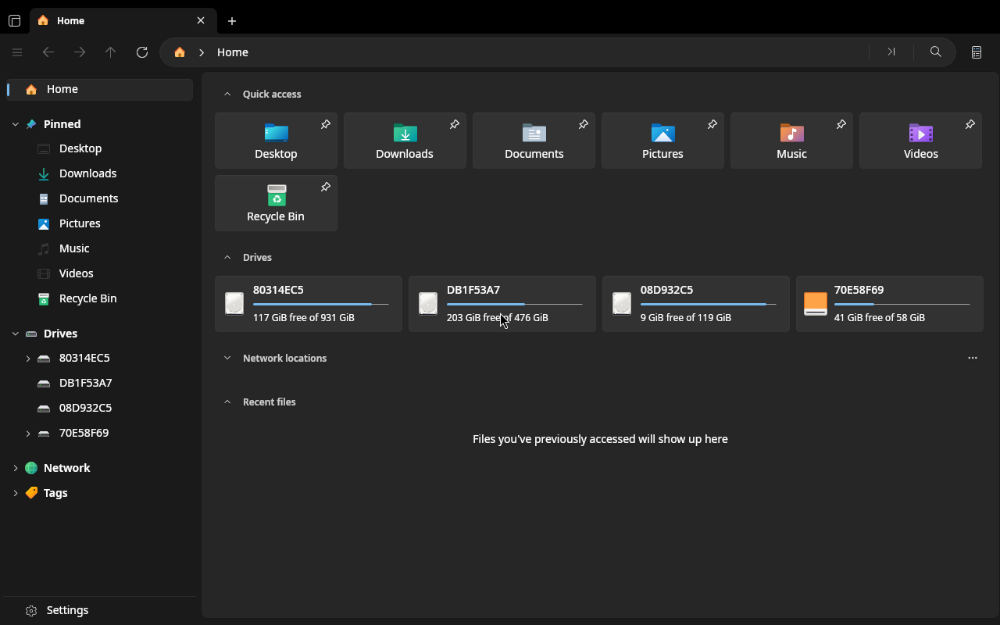
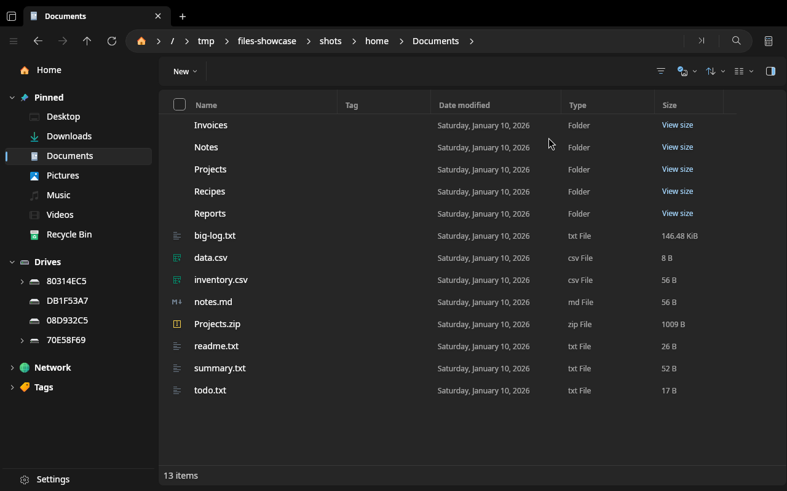
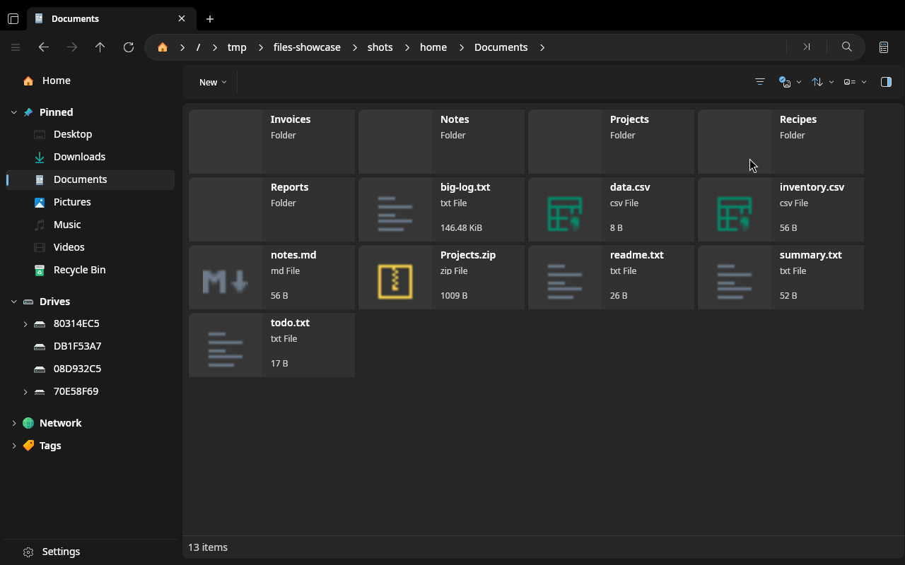
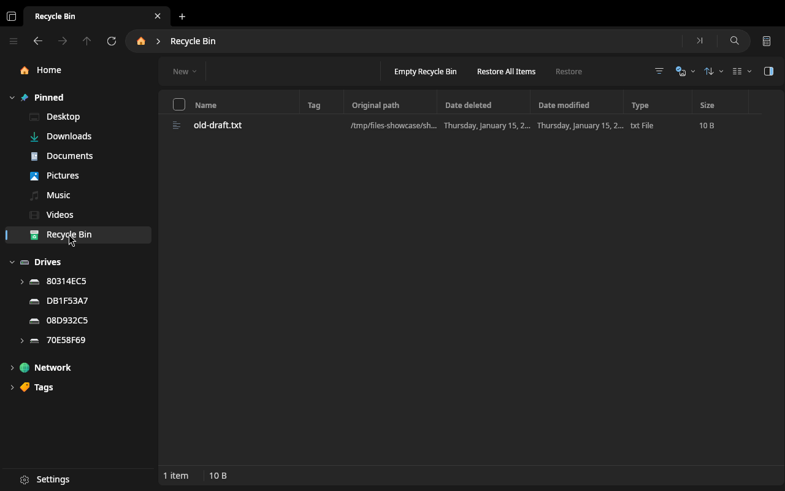
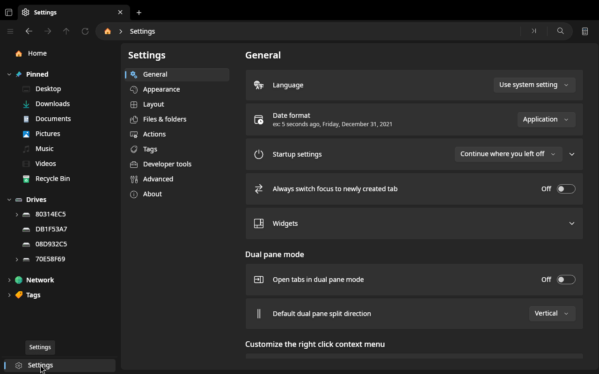
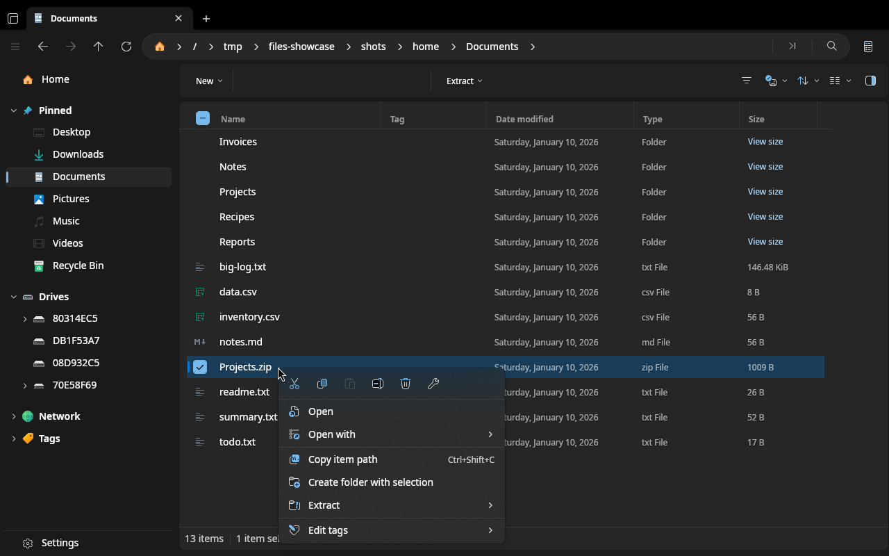
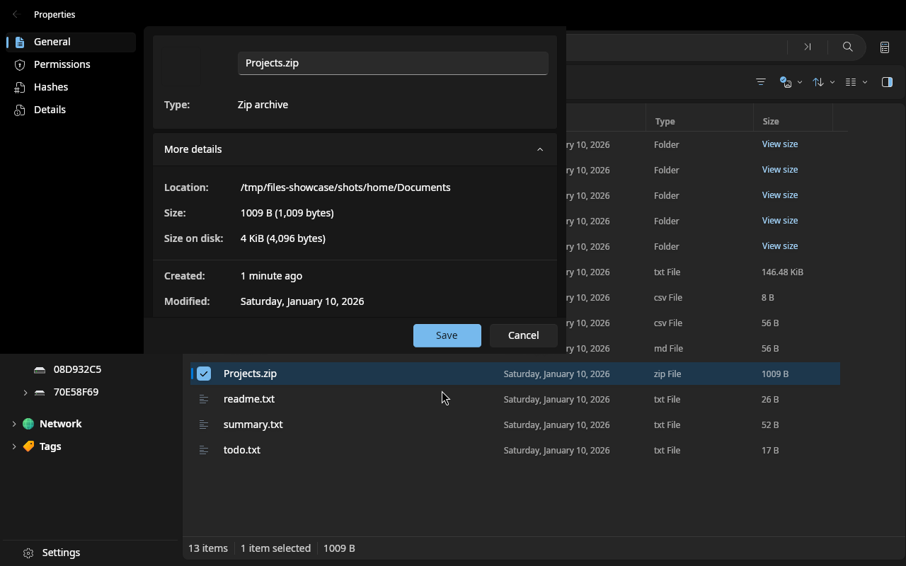

# Linux port showcase

LinuxFiles (the Files app running natively on Linux) (Uno Platform, Skia, X11). The screenshots are taken headlessly from a sandboxed
home directory with synthetic drives (random labels, made-up sizes), so they never show the real machine's files, drives or user name.

The shots use the public "Win11" icon theme, selected the way the app does on a real desktop (kdeglobals `[Icons] Theme=`, GTK settings) inside the sandbox. The theme is copied into the sandbox only and is not part of this repository. Folder icons in the file lists render blank with this theme; the Home and sidebar icons come from it.

Last updated: commit `8d4ccd67b`, 2026-10-05 (see `showcase/captured.txt` for the exact shot list).

## What works today

Taken from the merged state of `main` and [PLAN.md](PLAN.md).

- [x] App launches on Linux with the full Files shell: Home page, sidebar, tabs, toolbar, Settings
- [x] Folder listing in Details and Grid/Cards layouts, with sorting and selection
- [x] File operations through `IFileOperationsService` (copy, move, rename with Linux name rules)
- [x] Trash backend (XDG trash spec) and archives (SharpCompress, hardened extraction)
- [x] Hardened launching: no auto-running executables or untrusted `.desktop` files, exact-argv confirmation dialogs
- [x] File clipboard (gnome-copied-files, uri-list, KDE cut) and outbound drag and drop over XDND
- [x] Properties window with POSIX permissions, hashes and details pages
- [x] Single instance, `org.freedesktop.FileManager1`, recent files, xattr tags, D-Bus notifications, pkexec elevation
- [x] UDisks2 volumes and GVfs network locations in Drives, sidebar, widgets, format and eject
- [x] Phase 4 complete
- [x] Archive browsing (open a zip like a folder, with the Extract actions in the context menu)
- [x] Grid layout virtualization (wrapping Cards grid instead of a single sideways row)
- [x] Renamed to LinuxFiles

## Not working yet

- [ ] Some UI text still says "Windows" (for example "Open in Windows Terminal")
- [ ] Network locations stay empty without a GVfs session
- [ ] No native Wayland (runs through XWayland), no AT-SPI accessibility

## Screenshots

Home page: Quick access, and the Drives widget with usage bars. The drives are synthetic (random labels, made-up sizes).

A folder in Details layout.

The same folder in the Cards layout, chosen from the layout menu.

The Recycle Bin listing the trashed item from the XDG trash.

Settings page.

Right-click menu on an archive, with Extract and the Win11 icons.

Properties window of a file (a separate window; parts of the main window behind it are stale because the headless X server has no window manager).

## How to regenerate

Run `scripts/linux/showcase.sh` (add `--no-build` to reuse the existing build; set `SHOWCASE_ICON_THEME=Win11` to render with an installed icon theme, copied read-only into the sandbox). It uses `scripts/linux/headless-run.sh`,
so nothing touches the real display, and rewrites `docs/linux-port/showcase/`. The synthetic drives come from `scripts/linux/showcase-drives.txt`.
Set `SHOWCASE_SKIP="name name"` to record a regressed shot as "not yet working".
